<<<<<<< HEAD
<div align="center">

# 🎓 UIR Disability App
### University International Rabat — Disability Management Platform


> A Java desktop application designed to streamline the management of requests and complaints from students with disabilities at the University International Rabat.

</div>

---

## 📋 Table of Contents

- [Overview](#-overview)
- [Features](#-features)
- [img](#-img)
- [Tech Stack](#-tech-stack)
- [Database Schema](#-database-schema)
- [Installation](#-installation)
- [Usage](#-usage)

---

## 🧾 Overview

The **UIR Disability App** is a Java Swing desktop application built for the **2025/2026 academic year**. It provides two separate interfaces:

- 👨‍💼 **Admin** — manages student accounts, requests, complaints, history and statistics
- 🎓 **Student** — submits and tracks personal requests, complaints and history

---

## ✨ Features

### 🔐 Authentication
- Email/password login with role-based routing
- SHA-256 password hashing
- Remember Me (saved via `java.util.prefs.Preferences`)
- Forgot Password — 3-step verification code flow
- Student registration with disability description + PDF upload

### 👨‍💼 Admin
- Real-time statistics dashboard (users, requests, complaints, accounts)
- Manage requests: validate, refuse, edit, export CSV
- Manage complaints: update status, add admin response
- Full history with reset and delete actions
- Account management: list, validate, edit, delete users

### 🎓 Student
- Submit and manage personal requests (demandes)
- Submit and manage personal complaints (réclamations)
- View personal history of processed requests/complaints

---

## 📸 img

### 🔑 Login
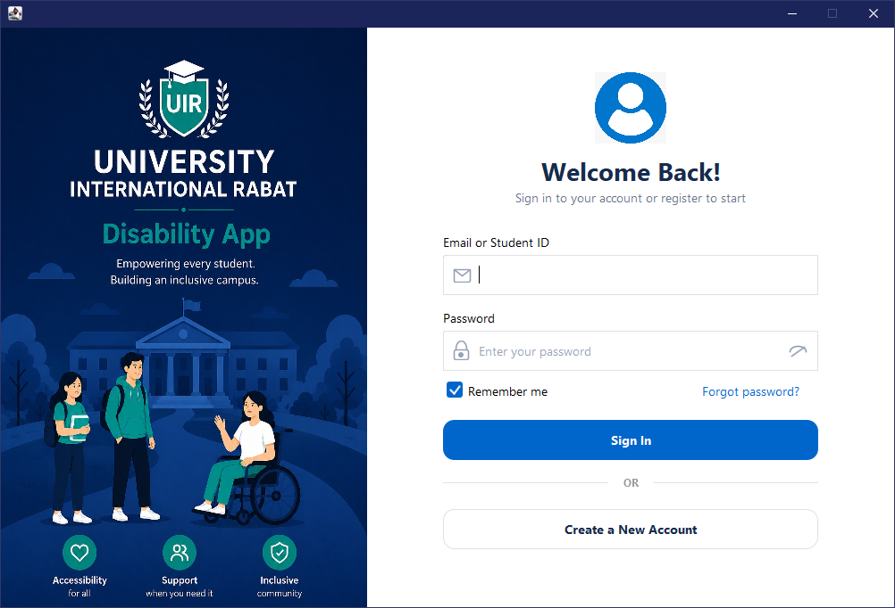

### 🔒 Forgot Password
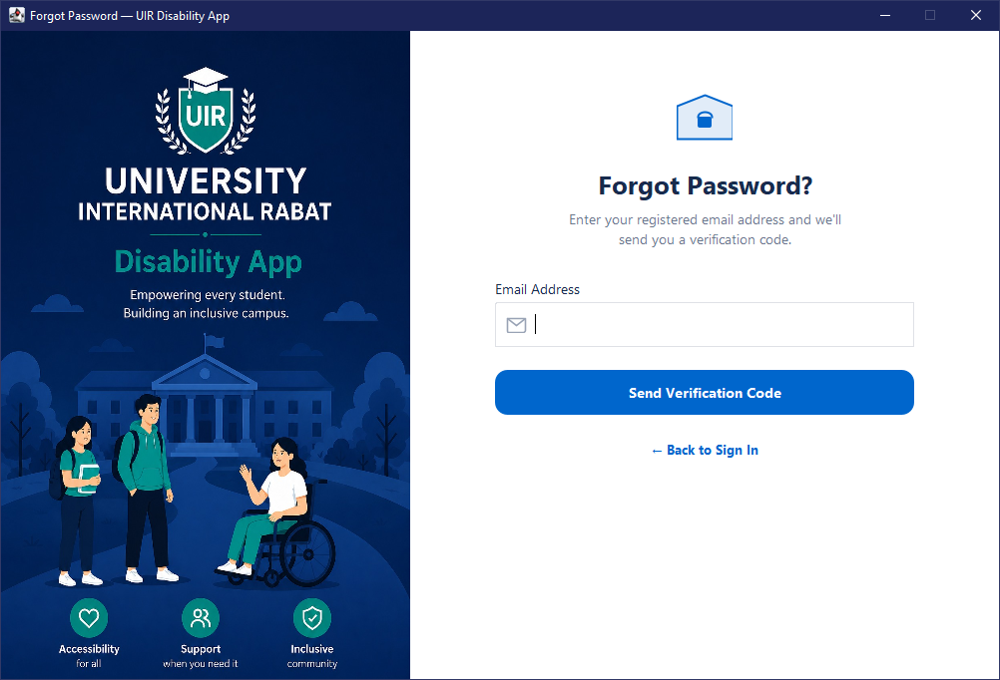

### 📝 Create Account
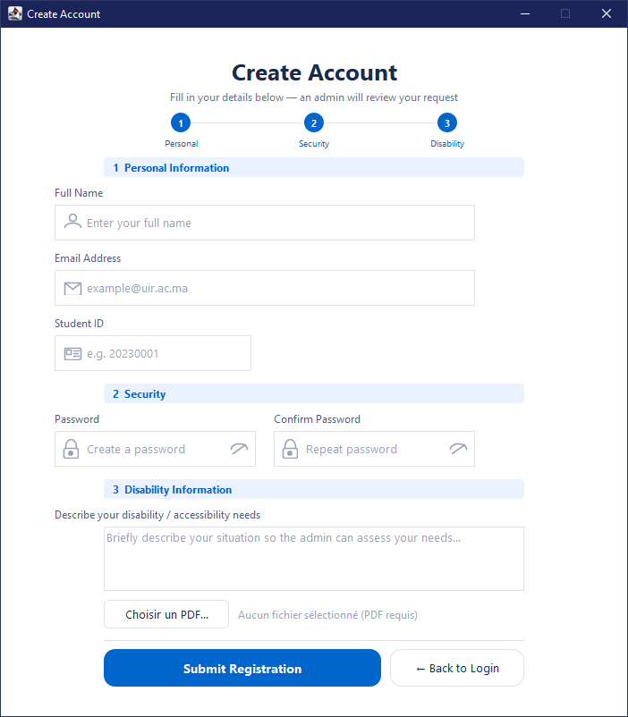

---

### 👨‍💼 Admin — Dashboard

#### Statistiques générales
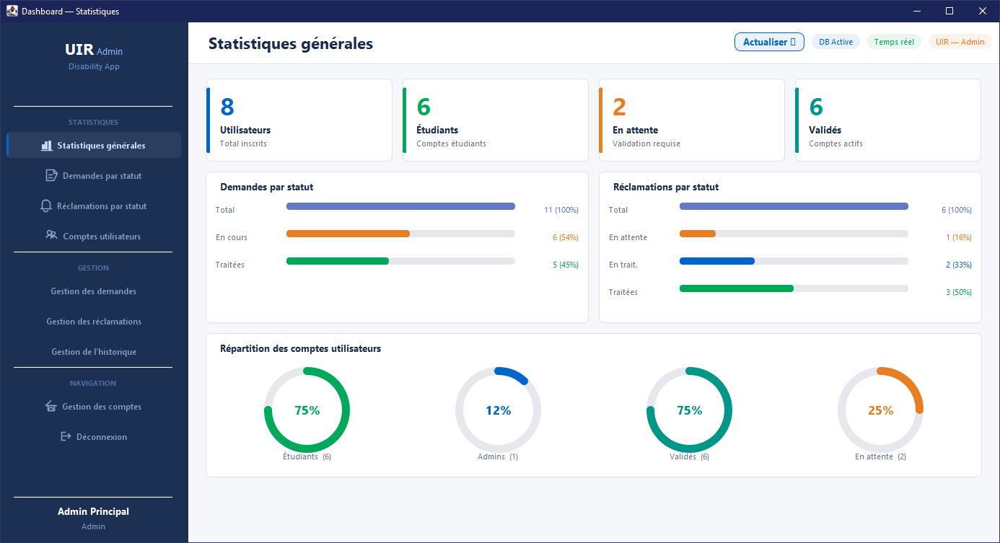

#### Demandes par statut
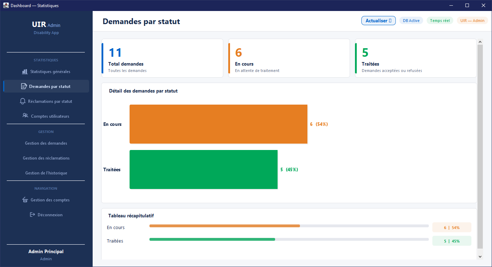

#### Réclamations par statut
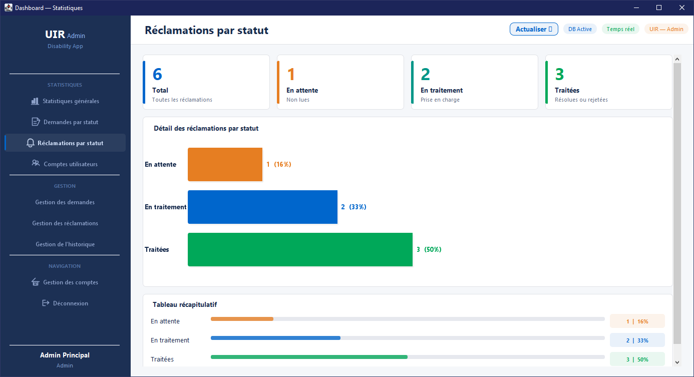

#### Comptes utilisateurs
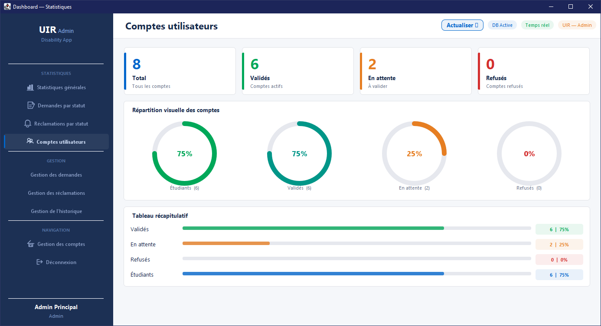

---

### 👨‍💼 Admin — Gestion

#### Gestion des demandes
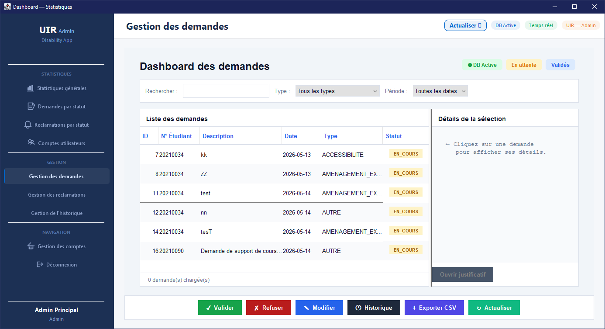

#### Gestion des réclamations
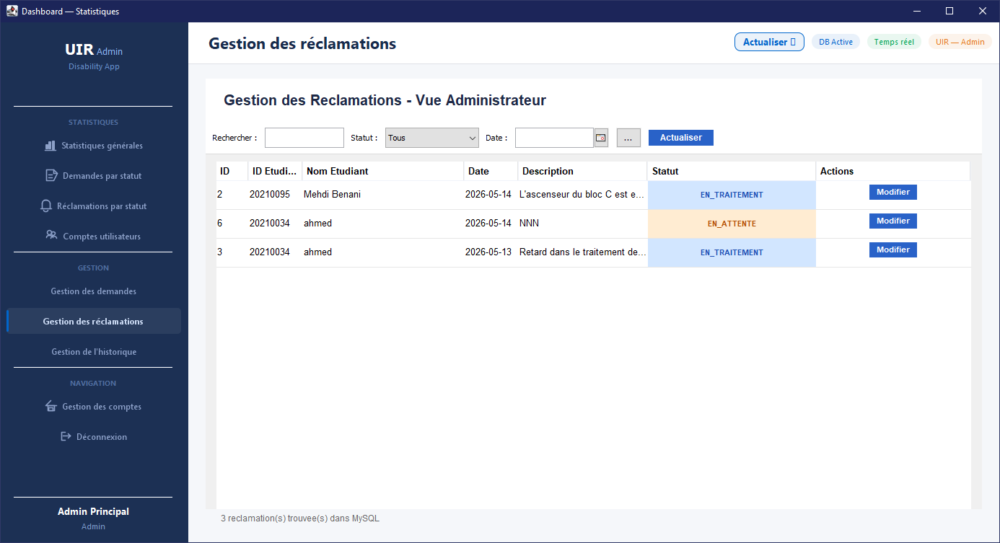

---

### 👨‍💼 Admin — Comptes

#### Liste des comptes
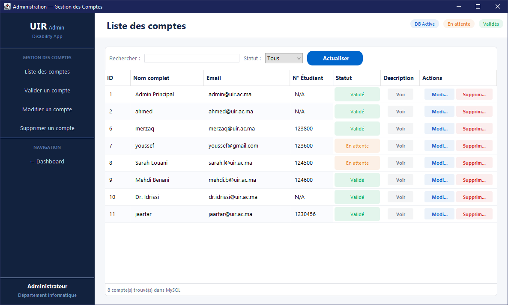

#### Valider un compte
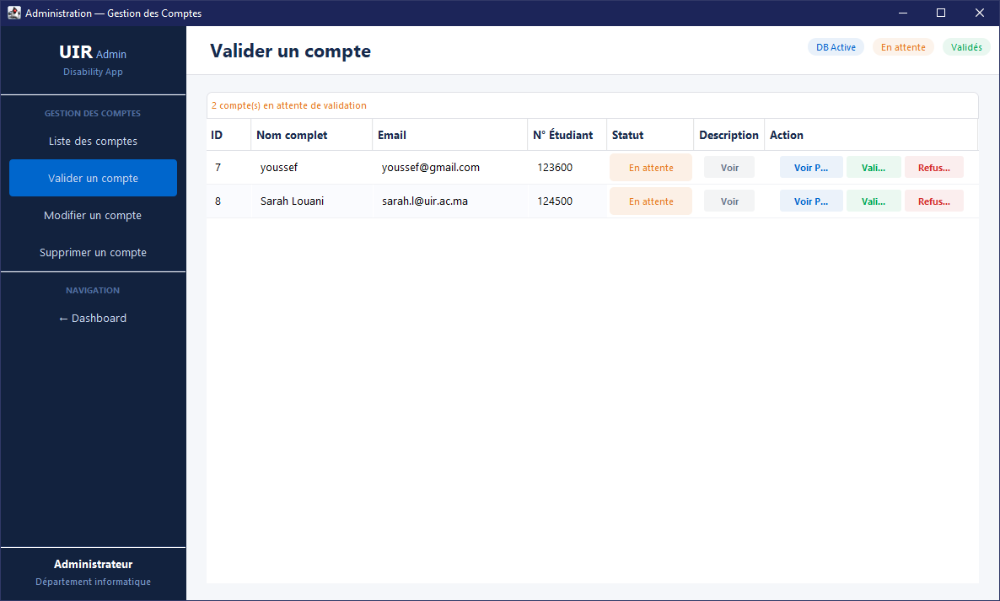

#### Modifier un compte
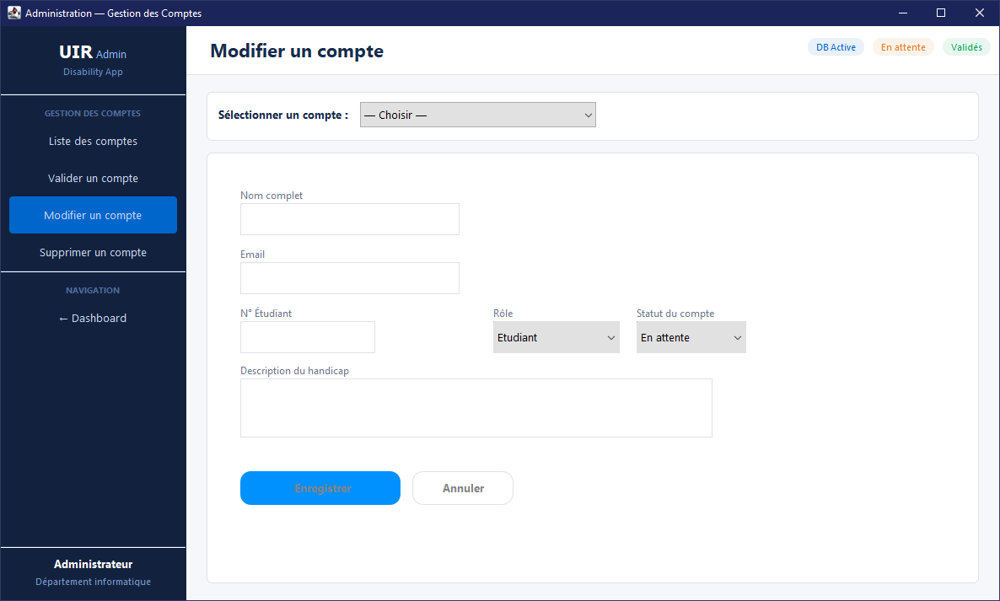

#### Supprimer un compte
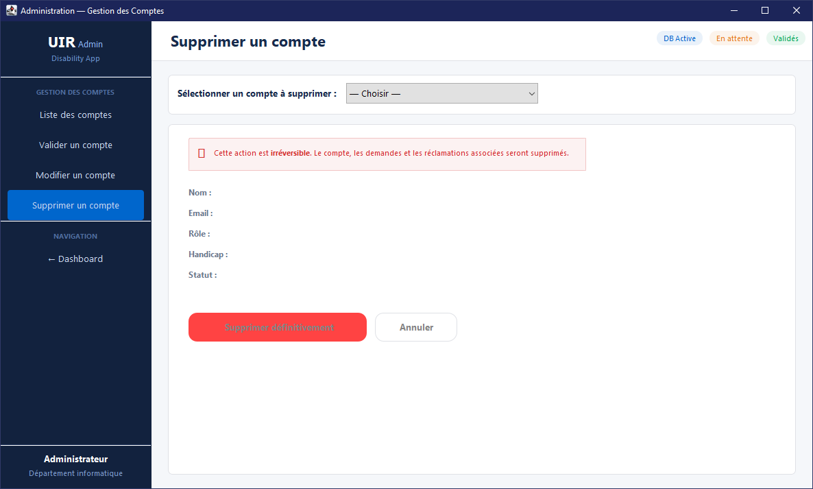

---

### 🎓 Student Interface

#### Mes Réclamations
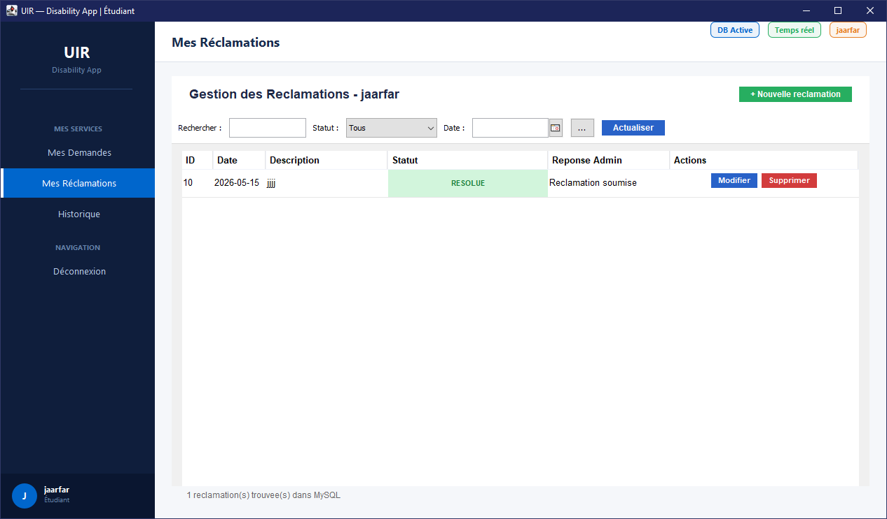

#### Historique
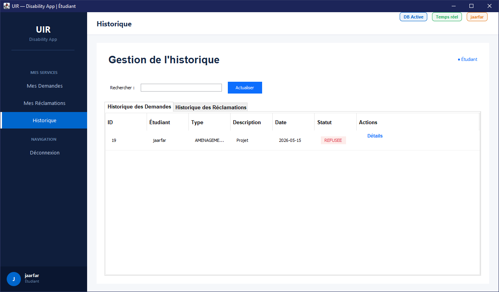

---

## 🛠 Tech Stack

| Layer | Technology |
|-------|-----------|
| Language | Java (JDK 17+) |
| UI Framework | Java Swing (custom painted components) |
| Database | MySQL 8 — `gestion_handicap_univ` |
| DB Connection | JDBC — `DatabaseConnection` singleton |
| Architecture | MVC (model / controller DAO / Views) |
| IDE | Apache NetBeans |
| Security | SHA-256 password hashing |

---

## 🗄 Database Schema

```
gestion_handicap_univ
├── utilisateur       (idUtilisateur, email, pwd, nom, role)
├── etudiant          (idEtudiant, idUtilisateur, handicap, compteValide)
├── admin             (idAdmin, idUtilisateur, departement)
├── demande           (idDemande, desc, date, type, statut, idEtudiant)
├── reclamation       (idRecla, date, desc, statut, action, idEtudiant)
└── piecejustificatif (idPiece, nom, desc, dateAjout, chemin, idDemande)
```

**Enums:**
- `TypeDemande`: `AMENAGEMENT_EXAMEN` · `ACCESSIBILITE` · `ACCOMPAGNEMENT` · `AUTRE`
- `StatutDemande`: `EN_COURS` · `ACCEPTEE` · `REFUSEE`
- `StatutReclamation`: `EN_ATTENTE` · `EN_TRAITEMENT` · `RESOLUE` · `REJETEE`

---

## ⚙️ Installation

### Prerequisites
- Java JDK 17+
- MySQL Server on `localhost:3306`
- Apache NetBeans (or any Java IDE)

### Steps

```bash
# 1. Clone the repository
git clone https://github.com/Jaafar-Trabelsi/University-Disability-Platform.git

# 2. Import the database
# Open phpMyAdmin → gestion_handicap_univ → Import → gestion_handicap_univ.sql

# 3. Open project in NetBeans
# File → Open Project → select the cloned folder

# 4. Build & Run
# Run → Run Project (LoginFrame is the entry point)
```

### Default Admin Credentials
```
Email    : admin@uir.ac.ma
Password : (set during DB import)
Role     : ADMIN
```

---

## 🚀 Usage

1. **Students** register via "Create a New Account" — account starts as `En attente`
2. **Admin** validates the account via *Gestion des comptes → Valider un compte*
3. **Student** can now log in and submit requests or complaints
4. **Admin** processes them via *Gestion des demandes* / *Gestion des réclamations*

---

## 👥 Authors

- **Jaafar Trabelsi** — [GitHub](https://github.com/Jaafar-Trabelsi)
- **conqueror31** - [GitHub](https://github.com/conqueror31)
---

<div align="center">
Made with ❤️ for UIR — Academic Year 2025/2026
</div>
=======
# UIR-Disability-App
>>>>>>> ba61cb6bb1979d9d62536dea29e0ae27fdf7d6a0
